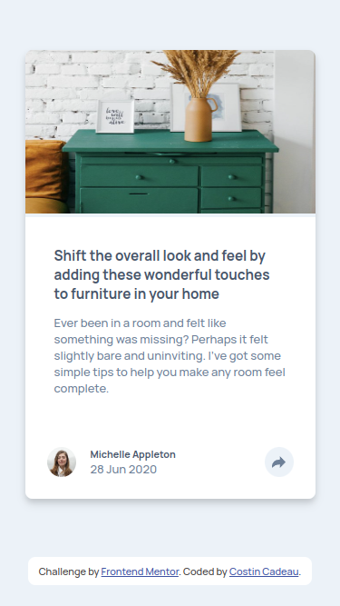

# Frontend Mentor - Article preview component solution

This is a solution to the [Article preview component challenge on Frontend Mentor](https://www.frontendmentor.io/challenges/article-preview-component-dYBN_pYFT). Frontend Mentor challenges help you improve your coding skills by building realistic projects. 

## Table of contents

- [Overview](#overview)
  - [The challenge](#the-challenge)
  - [Screenshot](#screenshot)
  - [Links](#links)
- [My process](#my-process)
  - [Built with](#built-with)
  - [Useful resources](#useful-resources)
- [Author](#author)

## Overview

### The challenge

Users should be able to:

- View the optimal layout for the component depending on their device's screen size
- See the social media share links when they click the share icon

### Screenshot

#### Desktop version :

#### Desktop version - Active :

#### Mobile version :

#### Mobile version - Active:

### Links

- Solution URL: [Repo Github](https://github.com/c-costin/article-preview-component)
- Live Site URL: [Live Website](https://your-live-site-url.com)

## My process

### Built with

- Semantic HTML5 markup
- CSS custom properties
- Flexbox
- Mobile-first workflow
- Javascript Vanilla

### Useful resources

- [Doc MDN - CSS](https://developer.mozilla.org/en-US/docs/Web/CSS) - I used to remember some properties.
- [Doc MDN - Javacript](https://developer.mozilla.org/en-US/docs/Web/JavaScript) - I consulted to see Event and Selector.
- [CSS clip-path maker](https://bennettfeely.com/clippy/) - This site is really convenient to create forms.

## Author

- Website - [costincadeau.fr](https://costincadeau.fr)
- Frontend Mentor - [@c-costin](https://www.frontendmentor.io/profile/c-costin)